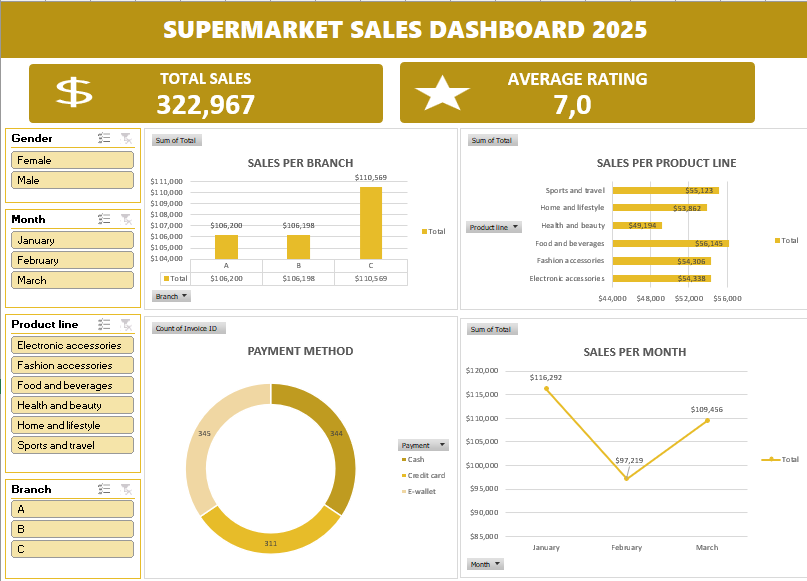

# Supermarket Sales Dashboard (Excel)

## Description
This project analyzes supermarket sales data obtained from Kaggle to monitor sales performance across branches, product lines, and customer segments. The Excel dashboard provides clear insights into sales trends and purchasing behavior.

## Dataset
- Source: Kaggle
- Records: ~1,000 rows
- Data includes invoice ID, branch, city, gender, product line, unit price, quantity, tax 5%, total, payment method, gross margin, gross income, and rating.

## Dashboard Features
- Key Performance Indicators (KPIs) for total sales and average rating
- Pivot table analysis of:
  - Sales per branch
  - Sales per product line
  - Sales per payment method
  - Monthly sales trends
- Interactive slicers for dynamic filtering

## Tools & Techniques
- Microsoft Excel
- Pivot Tables
- KPI metrics
- Sales trend analysis
- Interactive dashboard design

## Preview

